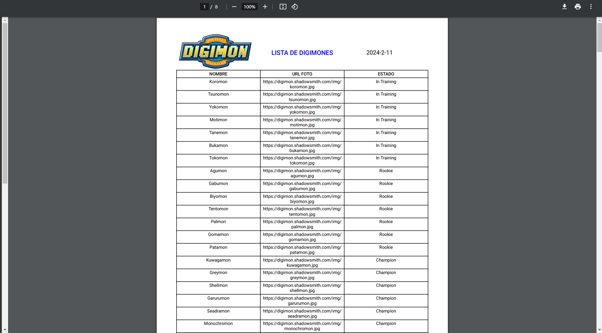
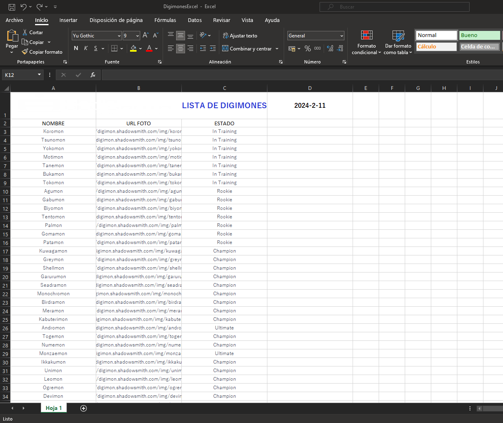

# POKÉMON

For this small project we are going to use a public API about Pokémon **https://digimon-api.vercel.app/api/digimon**
We list the Pokémon in a table and we will add a filter to facilitate your search. Later we will use the **pdfmake-wrapper** library to design a format and export the entire list to a PDF, and also export to EXCEL using the **ExcelJS** library. It is actually a super simple project, but it will serve as a basis for understanding the library and APIS consumption.

### Web

### Pdf

### Excel

#### If it has been useful to you, don't forget to leave your star in the repository :tada: